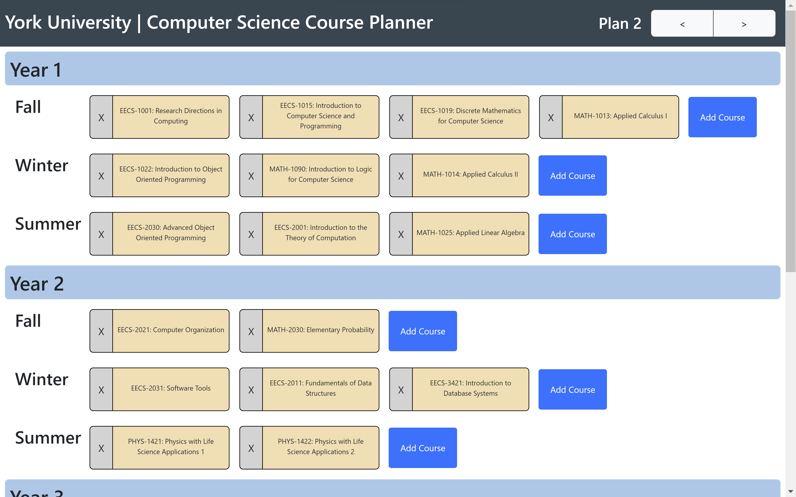
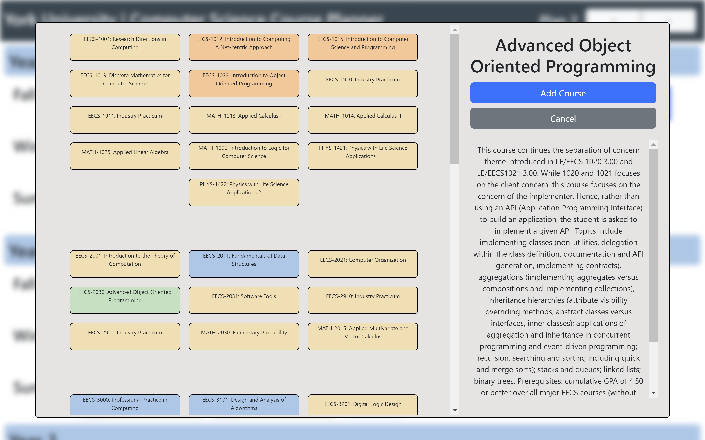

# York University Computer Science: Course Planner

This project is a simple web-app designed to help York University computer science students plan their courses.

> [!CAUTION]
> This project is not affiliated with York University and is not actively maintained. It may contain incomplete, inaccurate, or out of date information regarding courses and prerequisites. Always consult official York University resources when planning your degree or selecting courses.

Currently, this project is not deployed. To run it locally, please follow the instructions in the _Getting Started_ section.

This project draws inspiration from https://presidentkevvol.github.io/YorkCSClassList/.

## Getting started

Setting up a development environment

To get started, clone the repo with `git clone https://github.com/christopher-dembski/course-planner.git`.

Then, run `npm install` to install dependencies.

To run the app in development mode, run `npm start`.

## Available Scripts

In the project directory, you can run:

### `npm start`

Runs the app in the development mode.\
Open [http://localhost:3000](http://localhost:3000) to view it in the browser.

The page will reload if you make edits.\
You will also see any lint errors in the console.

### `npm test`

Launches the test runner in the interactive watch mode.\
See the section about [running tests](https://facebook.github.io/create-react-app/docs/running-tests) for more information.

### `npm run build`

Builds the app for production to the `build` folder.\
It correctly bundles React in production mode and optimizes the build for the best performance.

The build is minified and the filenames include the hashes.\
Your app is ready to be deployed!

See the section about [deployment](https://facebook.github.io/create-react-app/docs/deployment) for more information.

### `npm run eject`

**Note: this is a one-way operation. Once you `eject`, you can’t go back!**

If you aren’t satisfied with the build tool and configuration choices, you can `eject` at any time. This command will remove the single build dependency from your project.

Instead, it will copy all the configuration files and the transitive dependencies (webpack, Babel, ESLint, etc) right into your project so you have full control over them. All of the commands except `eject` will still work, but they will point to the copied scripts so you can tweak them. At this point you’re on your own.

You don’t have to ever use `eject`. The curated feature set is suitable for small and middle deployments, and you shouldn’t feel obligated to use this feature. However we understand that this tool wouldn’t be useful if you couldn’t customize it when you are ready for it.

### `npm run lint`

Runs eslint and prettier. Fixes issues that can be resolved automatically and provides a warning for issues that must be resolved manually.

## Images

